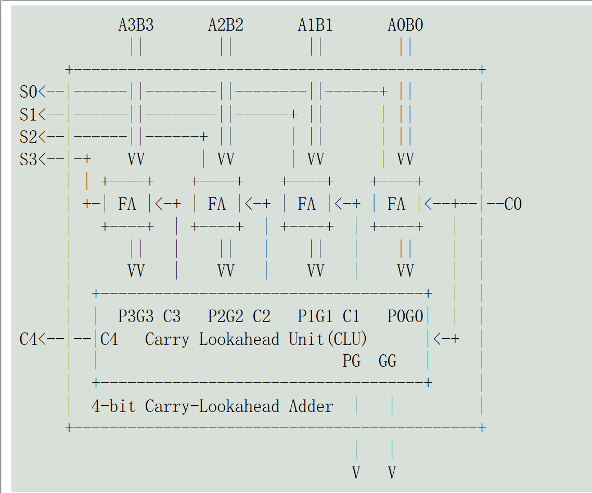
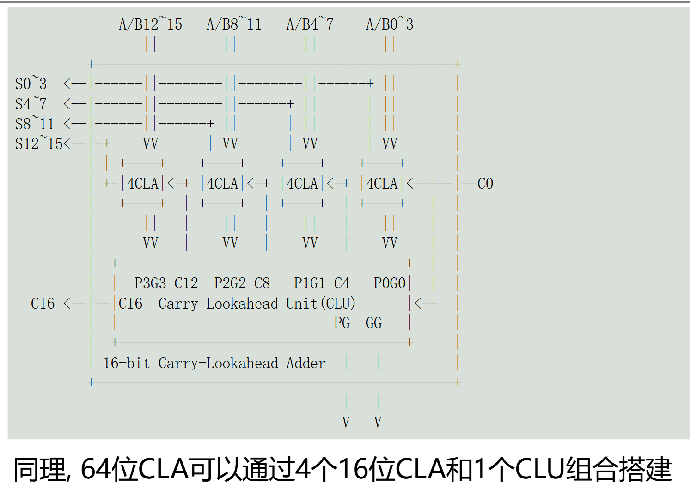

<!-- .slide: style="text-align: left;"> -->  
# Adder
By YSYX-Tmmo
----

## What is adder?
--

<!-- .slide: style="text-align: left;"> -->  
### A simple Adder
C++:
``` c++
sum = a + b;
```
Verilog:
``` Verilog
assign sum = a + b;
```
ASM:
```asm
add a0, a1, a2
```
--

<!-- .slide: style="text-align: left;"> -->  
### in logisim


--

<!-- .slide: style="text-align: left;"> -->  
For "add" still need carry out, so:
```Verilog
sum  = a ^ b
cout = a & b
```


But it only can add one bit
----

<!-- .slide: style="text-align: left;"> -->  
## How to add more bit in circuit?
series adder
--

<!-- .slide: style="text-align: left;"> -->  
### Full Adder
- HA can only output carry
- FA should handle the carry from last adder

--

<!-- .slide: style="text-align: left;"> --> 
### How much time it takes?
- Define one gate need 1 delay time（1d）
- D(x) : the delay time of x
- eg: $D(FA_c) = 3d$

--

<!-- .slide: style="text-align: left;"> --> 
### Ripple-Carry Adder 

- $D(RCA_c)=12d$ or $D(RCA_c)=9d$ ? 
- Can it be fater?
----

<!-- .slide: style="text-align: left;"> --> 
## observe
--

<!-- .slide: style="text-align: left;"> --> 
### observe
- $D(cout)=3d$
- $D(sum)=2d$

--

<!-- .slide: style="text-align: left;"> --> 
### observe
For FA
- $cout = ((a ^ b) & cin) | (a & b)$
- $sum = a ^ b ^ cin$

For RCA 
- $Cout_0 = ((a_0 ^ b_0) & cin) | (a_0 & b_0)$
- $Cout_1 = ((a_1 ^ b_1) & cout_0) | (a_1 & b_1)$
- $Cout_2 = ((a_2 ^ b_2) & cout_1) | (a_2 & b_2)$
- $Cout_3 = ((a_3 ^ b_3) & cout_2) | (a_3 & b_3)$
--

<!-- .slide: style="text-align: left;"> --> 
### observe
$$
Cout_1 = ((a_1 ^ b_1) & (((a_0 ^ b_0) & cin) | (a_0 & b_0))) | (a_1 & b_1)
Cout_3 = ((a_3 ^ b_3) & (((a_2 ^ b_2) & (((a_1 ^ b_1) & 
           (((a_0 ^ b_0) & cin) | (a_0 & b_0))) | (a_1 & b_1))) | 
           (a_2 & b_2))) | (a_3 & b_3)
$$
--

<!-- .slide: style="text-align: left;"> --> 
### observe
Define
- $G = a & b$
- $P = {a} $^$ {b}$

$$
Cout_1 = ((a_1 ^ b_1) & (((a_0 ^ b_0) & cin) | (a_0 & b_0))) | (a_1 & b_1)
        = (((a_1 ^ b_1) & ((a_0 ^ b_0) & cin)) | ((a_1 ^ b_1) &(a_0 & b_0))) | (a_1 & b_1)
        = (P_1 & P_0 & cin) | (P_1 & G_0) | G_1
Cout_3 = ((a_3 ^ b_3) & (((a_2 ^ b_2) & (((a_1 ^ b_1) & 
           (((a_0 ^ b_0) & cin) | (a_0 & b_0))) | (a_1 & b_1))) | 
           (a_2 & b_2))) | (a_3 & b_3)
           =(P_3 & P_2 & P_1 & P_0 & cin) | (P_3 & P_2 & P_1 & G_0) |
           (P_3 & P_2 & G_1) |(P_3 & G_2) | G_3
$$
--

<!-- .slide: style="text-align: left;"> --> 
### How much time it will take?

- $Cout_1  = (P_1 & P_0 & cin) | (P_1 & G_0) | G_1$
- $Sum_1 = a_1 ^ b_1 ^ Cout_0$
- $Cout_3  =(P_3 & P_2 & P_1 & P_0 & cin) | (P_3 & P_2 & P_1 & G_0) |
           (P_3 & P_2 & G_1) |(P_3 & G_2) | G_3$
- $Sum_3 = a_3 ^ b_3 ^ Cout_2$

--

<!-- .slide: style="text-align: left;"> --> 
### How much time it will take?

- $Cout_1  = (P_1 & P_0 & cin) | (P_1 & G_0) | G_1$
- $Sum_1 = a_1 ^ b_1 ^ Cout_0$
- $Cout_3  =(P_3 & P_2 & P_1 & P_0 & cin) | (P_3 & P_2 & P_1 & G_0) |
           (P_3 & P_2 & G_1) |(P_3 & G_2) | G_3$
- $Sum_3 = a_3 ^ b_3 ^ Cout_2$
- $D(Cout_x) = 3d$
- $D(Sum_x) = 4d$
----

## Carry-Lookahead Adder
--

<!-- .slide: style="text-align: left;"> --> 
### Carry-Lookahead Adder
- $D(Cout_x) < D(Sum_x)$
- $D(Cout_x) = 3d$
- $D(Sum_x) = 4d$

Does it have any disadvantages?
--

<!-- .slide: style="text-align: left;"> --> 
### Carry-Lookahead Adder
Does it have any disadvantages?
- $C_4 = G_3 | (G_2 & P_3) | (G_1 & P_2 & P_3) | (G_0 & P_1 & P_2 & P_3) |
 (cin & P_0 & P_1 & P_2 & P_3)$
- $C_64 = G_63 | (G_62 & P_63) | (G_61 & P_62 & P_63) | 
(G_60 & P_61 & P_62 & P_63) | ...$

Super multi-input gate
- More energy
- More delay
- More hot

How to solve?
--

<!-- .slide: style="text-align: left;"> --> 
### Carry-Lookahead Adder
#### Group CLA

Define
- GG = G3 | (G2 & P3) | (G1 & P2 & P3) | (G0 & P1 & P2 & P3)
- PG = PG = P0 & P1 & P2 & P3
- C4 = GG | (C0 & PG)
--

<!-- .slide: style="text-align: left;"> --> 
#### Group CLA

--

<!-- .slide: style="text-align: left;"> --> 
#### Group CLA

--

<!-- .slide: style="text-align: left;"> --> 
#### Group CLA16 cost
For CLA16
- D(P) = D(G) = d
- D(PG) = 2d,D(GG)=3d
- $D(Cout_{0,1,2})=3d$
- $D(Cout_{3,7,11,15})=5d$
- $D(Cout_{4,5,6,8,9,10,12,13,14})=7d$
- $D(Sum_15) = 8d$

For RCA16
- $D(Cout_15) = 33d$
- $D(Sum_15) = 32d$