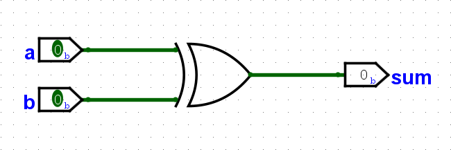
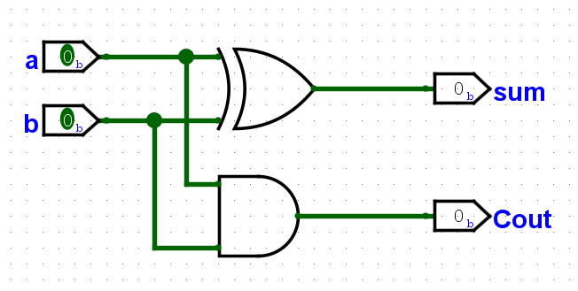
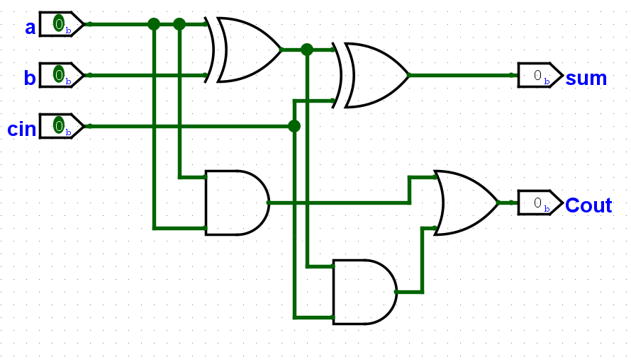
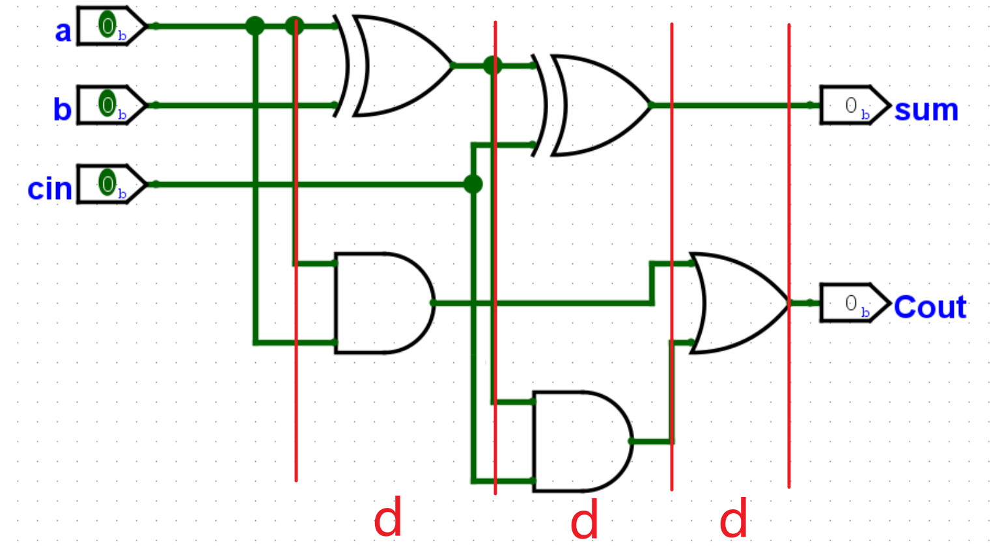
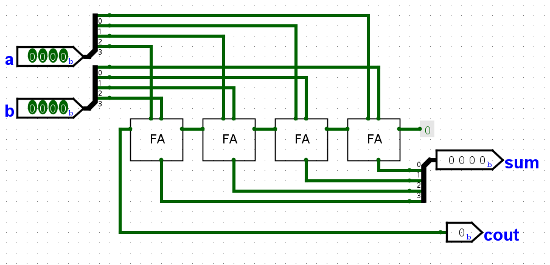

<!-- .slide: style="text-align: left;"> -->  
# Adder
By YSYX-Tmmo
----

## What is adder?
--

<!-- .slide: style="text-align: left;"> -->  
### A simple Adder
C++:
``` c++
sum = a + b;
```
Verilog:
``` Verilog
assign sum = a + b;
```
ASM:
```asm
add a0, a1, a2
```
--

<!-- .slide: style="text-align: left;"> -->  
### in logisim


--

<!-- .slide: style="text-align: left;"> -->  
For "add" still need carry out, so:
```Verilog
sum  = a ^ b
cout = a & b
```


But it only can add one bit
----

<!-- .slide: style="text-align: left;"> -->  
## How to add more bit in circuit?
series adder
--

<!-- .slide: style="text-align: left;"> -->  
### Full Adder
- HA can only output carry
- FA should handle the carry from last adder

--

<!-- .slide: style="text-align: left;"> --> 
### How much time it takes?
- Define one gate need 1 delay time（1d）
- D(x) : the delay time of x
- eg: $D(FA_c) = 3d$

--

<!-- .slide: style="text-align: left;"> --> 
### Ripple-Carry Adder 

- $D(RCA_c)=12d$ or $D(RCA_c)=9d$ ? 
- Can it be fater?

